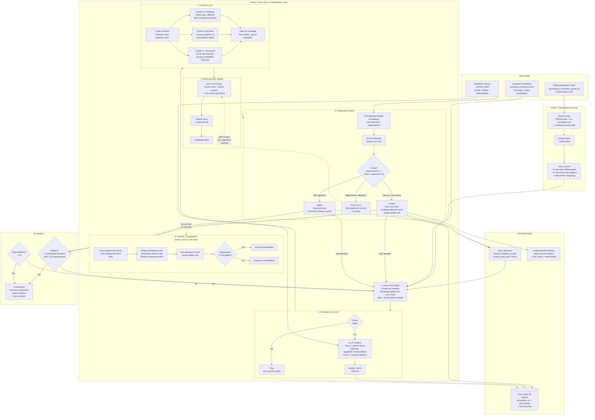
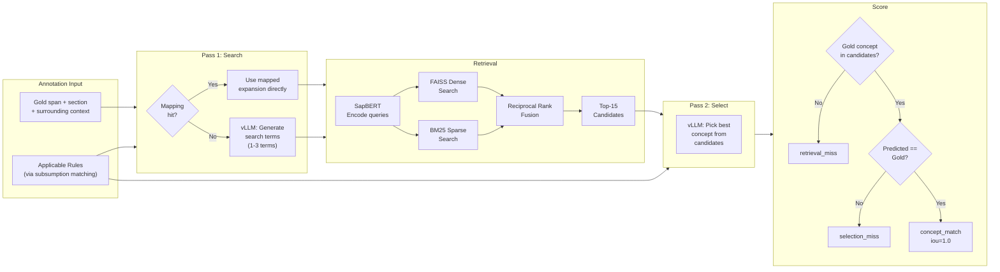
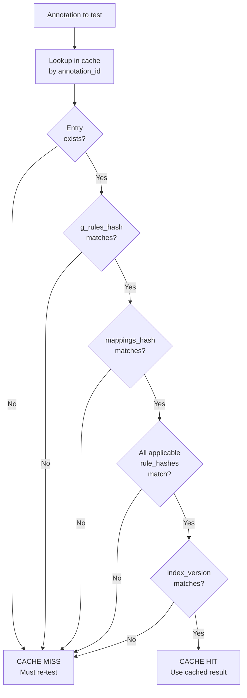
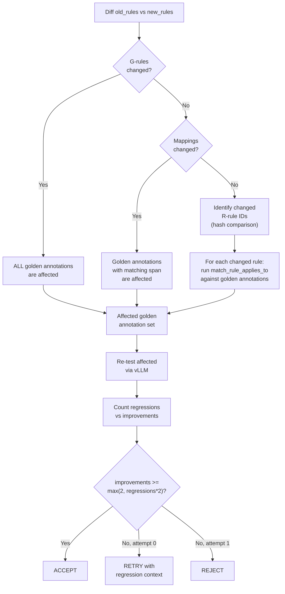

# Self-Improving Rule Generation Loop

## Context

The SNOMED CT entity linking pipeline uses LLM-generated rules (v4.0) to guide a two-pass agent through search term generation and concept disambiguation. Current accuracy is ~48% on individual notes. Rules are generated by Claude Opus from whole annotated notes, but this approach doesn't scale: sequential note processing causes compute waste (redundant extraction for solved concepts) and rule thrashing (new rules break old successes).

We need a fully automated, error-driven loop that generates rules from failures, caches test results to avoid redundant work, and guards against regressions — all without a human in the loop.

## System Architecture



### Test Pipeline Detail (Per Annotation)



### Cache Validity Logic



### Rule Change Regression Detection



---

## Files

### New Files

| File | Purpose |
|------|---------|
| `scripts/test_cache.py` | Rule hashing + SQLite test result cache |
| `scripts/error_clustering.py` | Cluster failures into actionable groups for LLM |
| `scripts/golden_set.py` | Regression detection + automated accept/reject |
| `scripts/rule_improvement_loop.py` | Main orchestrator |

### Modified Files

| File | Change |
|------|--------|
| `scripts/rule_generation.py` | Add `--mode error-fix` and `--mode consolidate` prompts |
| `scripts/rule_testing.py` | Extract `prepare_and_test_annotations()` callable from orchestrator; add `load_notes_bulk()` |

### Key Inputs

| File | Purpose |
|------|---------|
| `docs/official_annotation_guide.md` | Official annotation guidelines (16 rules) — seeds initial G-rules |
| `scripts/sampled_annotations.json` | 128 notes in greedy set-cover order, 14,964 annotations |
| `snomed_index/subsumption.pkl` | SNOMED hierarchy for applies_to matching |

---

## Bootstrap Strategy

Instead of starting from scratch or from existing v4.0 rules, the loop bootstraps from the **official annotation guidelines** (`docs/official_annotation_guide.md`). These 16 rules define what the annotators were instructed to do and map directly to G-rules:

- **Rules 1-2** (most detailed concept, full entailment) → G-rule for stage_3_select
- **Rule 7** (+/- 1 sentence context) → G-rule for stage_2_search context scope
- **Rules 9-10** (negative/unverified findings still annotated) → G-rule for stage_2_search + stage_3_select
- **Rule 13** (hierarchy preference: Procedure > Finding > Body Structure) → G-rule for stage_3_select
- **Rule 14** (ignore structured headings) → G-rule for stage_2_search filtering
- **Rule 15** (in-situ findings for physical objects) → G-rule for stage_3_select
- **Rule 16** (ignore lab result values) → G-rule for stage_2_search filtering

The bootstrap prompt gives Opus these official guidelines plus the first annotated note and asks it to: (1) convert the guidelines into G-rules in our JSON format, (2) discover structured R-rules from the note's annotation patterns, (3) generate mappings for abbreviations seen.

---

## Component Details

### 1. Test Cache (`scripts/test_cache.py`)

SQLite-backed cache mapping each annotation to its test outcome under a specific rule configuration. ~52K annotations, ~26MB — too large for JSON round-trips every iteration.

#### Rule hashing

Hash the *functional content* of each rule (fields that affect the LLM prompt), not IDs:

```python
def hash_rule(rule: dict) -> str:
    """Hash structured rule's functional fields -> 16-char hex."""
    functional = {
        "concept_type": rule.get("concept_type"),
        "applies_to": rule.get("applies_to"),
        "stage_2_search": rule.get("stage_2_search"),
        "stage_3_select": rule.get("stage_3_select"),
    }
    return sha256(json.dumps(functional, sort_keys=True).encode()).hexdigest()[:16]

def hash_g_rules(g_rules: list[dict]) -> str: ...  # all g_rules sorted by id
def hash_mappings(mappings: dict) -> str: ...       # sorted keys
```

#### Schema

```sql
CREATE TABLE cache_entries (
    annotation_id       INTEGER PRIMARY KEY,
    note_id             TEXT NOT NULL,
    gold_concept_id     INTEGER NOT NULL,
    gold_span           TEXT NOT NULL,
    section             TEXT,
    g_rules_hash        TEXT NOT NULL,
    mappings_hash       TEXT NOT NULL,
    applicable_rule_hashes TEXT NOT NULL,  -- JSON sorted array
    index_version       TEXT NOT NULL,     -- hash of snomed_index dir mtime
    concept_match       INTEGER NOT NULL,  -- 0/1
    pred_concept_id     INTEGER,
    iou                 REAL,
    failure_reason      TEXT,
    search_terms        TEXT,              -- JSON array
    n_candidates        INTEGER,
    gold_in_candidates  INTEGER,
    gold_rank           INTEGER,
    tested_at           TEXT NOT NULL
);
```

#### Cache validity

An annotation's cached result is valid iff: `g_rules_hash`, `mappings_hash`, all `applicable_rule_hashes`, and `index_version` match. If any differ, the annotation must be re-tested.

#### Public API

- `TestCache(db_path)` — open/create the SQLite DB
- `.is_valid(annotation_id, g_hash, m_hash, rule_hashes, idx_version) -> bool`
- `.get(annotation_id) -> dict | None` — retrieve cached result
- `.put(annotation_id, ..., result_dict)` — upsert cache entry
- `.put_batch(results: list[dict])` — bulk upsert
- `.get_all_passing() -> list[dict]` — golden set query
- `.get_failures(note_id=None) -> list[dict]` — failures query
- `.invalidate_by_rules(changed_rule_ids, subsumption_idx, rules)` — targeted invalidation
- `.stats() -> dict` — cache hit/miss/pass/fail counts

---

### 2. Error Clustering (`scripts/error_clustering.py`)

Takes failure results + current rules, produces ranked clusters for the rule generation LLM.

#### Cluster A — Ambiguity (same span, different gold concepts)

Group all results (not just failures) by `gold_span.strip().lower()`. Keep groups where there are 2+ unique gold concepts AND at least 1 failure. These are spans where context determines the correct concept — the LLM needs to see the contrasting examples.

Leverage score = number of failures in the group.

#### Cluster B — By applicable rule + failure type

Group failures by which structured rule(s) matched via `applies_to` subsumption. If R4 covers procedures and 8 of its matched annotations failed, that's a clear signal R4 needs work. Separate retrieval_miss from selection_miss.

Leverage score = number of failures for that rule.

#### Cluster C — Uncovered failures

Failures where no structured rule matched (only G-rules applied). These indicate missing rules for concept subtrees not yet covered. Group by SNOMED hierarchy of the gold concept.

Leverage score = number of failures in the group.

#### Cluster selection for prompt

1. Rank all clusters by leverage (descending)
2. Take clusters greedily until total failure examples reaches 30
3. If a cluster has >30 failures, subsample using diversity: prioritize different sections, different gold concepts, different failure types
4. Tag each cluster with its type so the prompt frames it appropriately

#### Public API

- `cluster_failures(all_results, rules, subsumption_idx) -> list[Cluster]`
- `select_for_prompt(clusters, max_examples=30) -> list[Cluster]`

---

### 3. Golden Set Regression Guard (`scripts/golden_set.py`)

The golden set = all annotations where `concept_match == 1` in the cache. No fixed size; grows as rules improve.

#### Finding affected golden annotations

When rules change, identify which golden entries need re-testing:

1. If **g_rules_hash changed** → ALL golden annotations are affected
2. If **mappings_hash changed** → golden annotations whose span matches any changed mapping key
3. If **structured rule R_n changed** (hash differs) → golden annotations where R_n's `applies_to` matches
4. If **structured rule R_new added** → golden annotations where R_new's `applies_to` matches
5. If **structured rule R_old removed** → golden annotations where R_old's `applies_to` matched

#### Acceptance logic

```
regressions = count of golden annotations that now FAIL
improvements = count of previously-failing annotations that now PASS

if regressions == 0:                              → accept
if improvements >= max(2, regressions * 2):       → accept (net positive)
if attempt == 0:                                  → retry with regression context
if attempt == 1 and above threshold:              → accept
else:                                             → reject
```

#### Public API

- `find_affected_golden(cache, old_rules, new_rules, subsumption_idx) -> list[int]`
- `evaluate_and_decide(old_rules, new_rules, cache, subsumption_idx, test_fn, attempt) -> Decision`

---

### 4. Rule Generation Modes (`scripts/rule_generation.py`)

#### 4a. Updated Bootstrap Mode (`--mode initial`)

The existing initial mode is updated to include the official annotation guidelines in the system prompt. The LLM receives:
1. The official guidelines text (from `docs/official_annotation_guide.md`)
2. The first annotated note with concept ancestry table
3. Instructions to convert the guidelines into G-rules and discover R-rules from the note

#### 4b. Error-Fix Mode (`--mode error-fix`)

New CLI args:
```
--mode error-fix
--error-clusters PATH     # JSON file with clusters
--regression-context PATH # Optional: regression details for retry
```

System prompt instructs conservative fixes:
- Receives current rules JSON + clustered failure examples with full context
- Must preserve working rules, change only the minimum necessary
- May modify stage_2_search/stage_3_select, add rules, add mappings, adjust applies_to
- Must not change existing rule IDs
- If regression context provided: must preserve previously-correct annotations

User prompt structure:
```
CURRENT RULES:
{rules JSON}

FAILURE CLUSTERS TO FIX:

--- Cluster 1: ambiguity (span: "discharge") --- 8 failures
  [contrasting examples with different gold concepts per section]

--- Cluster 2: hierarchy (rule R4: Procedure) --- 12 failures
  [failures where R4 applied, showing search terms and candidates]

--- Cluster 3: uncovered (hierarchy: finding) --- 5 failures
  [failures where no rule matched]

[REGRESSION WARNING if retry:]
  [list of annotations that must stay correct]

Produce updated rules JSON. Only change what is necessary.
```

#### 4c. Consolidation Mode (`--mode consolidate`)

Over many error-fix iterations, rules accumulate. A periodic consolidation pass asks Opus to:

1. **Merge** rules with overlapping `applies_to` and similar logic
2. **Generalize** narrow rules (e.g., separate "chest pain" and "back pain" rules with identical logic → one "pain findings" rule)
3. **Remove** rules fully subsumed by broader rules
4. **Tighten** overly broad rules causing failures

**When triggered**: Every 5 iterations, OR when structured rule count exceeds 30.

**Prompt includes**: full rules JSON + per-rule performance summary (from cache: annotations matched, pass rate, failure breakdown).

**Regression handling**: Full golden set check with lenient threshold (regressions <= 5% of golden set).

---

### 5. Orchestrator (`scripts/rule_improvement_loop.py`)

#### Persistent state (`scripts/loop_state.json`)

```json
{
  "current_rules_path": "scripts/rules/<timestamp>/rules.json",
  "iteration": 5,
  "notes_tested": ["18568215-DS-21", "14222873-DS-20"],
  "bootstrap_complete": true,
  "total_improvements": 47,
  "total_regressions": 3,
  "plateau_counter": 0,
  "history": [
    {"iteration": 1, "action": "accepted", "n_improvements": 12, "n_regressions": 0},
    {"iteration": 2, "action": "rejected", "reason": "regressions=5, improvements=3"}
  ]
}
```

#### Main loop

```
0. If no current_rules_path in state:
   - Run bootstrap: rule_generation.py --mode initial
     with official annotation guide + first sampled note
   - Test bootstrap rules on first 2 notes, populate cache
   - Save as iteration 0

1. Load state, cache, rules, subsumption index, sampled annotations
2. WHILE not plateau and iteration < max_iterations:
   a. Select next batch of notes (8 notes)
      - Bootstrap (first 2 iterations): greedy set-cover order
      - After bootstrap: rank by failure density (most failures first)
      - Skip notes that are fully cached with no invalidated entries
   b. Test batch via vLLM
      - For each annotation: check cache validity -> skip if valid, test if invalid
      - Run vllm_pipeline on uncached annotations
      - Update cache with new results
   c. Collect failures, run clustering
   d. If no failures or no actionable clusters -> increment plateau counter, continue
   e. Generate rule update via Opus error-fix mode
   f. Regression check:
      - Find affected golden annotations
      - Re-test affected subset with new rules via vLLM
      - Count improvements (re-test a sample of failures with new rules)
      - Apply acceptance logic
   g. If retry needed: re-generate with regression context, re-check
   h. If accepted: save new rules, invalidate affected cache entries, update state
      If rejected: increment plateau counter, log reason
   i. Consolidation check:
      - If iteration % 5 == 0 OR structured_rule_count > 30:
        run consolidation mode
        full regression check against golden set
        accept/reject with lenient threshold
   j. Save state (resumable)
3. Print final report (accuracy progression, rules evolution, cost)
```

#### Note batch selection

```python
def select_next_batch(sampled_note_ids, cache, batch_size=8, bootstrap_complete=False):
    if not bootstrap_complete:
        # Use greedy set-cover order, skip fully-cached-and-valid notes
        return [n for n in sampled_note_ids if not cache.note_fully_valid(n)][:batch_size]
    else:
        # Rank by failure count from cache, test worst-performing notes
        return cache.notes_ranked_by_failures()[:batch_size]
```

#### Plateau detection

Stop after 3 consecutive iterations where `n_improvements < max(2, 0.01 * n_tested)`. Hard cap at 20 iterations.

#### Refactoring `rule_testing.py` for reuse

Extract the core logic from `run()` into a callable function:

```python
def prepare_and_test_annotations(
    note_ids: list[str],
    rules: dict,
    subsumption_idx: SubsumptionIndex | None,
    annotation_filter: set[int] | None = None,
    vllm_url: str = "http://localhost:8000",
    vllm_model: str = "openai/gpt-oss-20b",
    reasoning_effort: str = "low",
    concurrency: int = 0,
) -> list[dict]:
    """Test annotations from given notes, return per-annotation results."""
```

Also add `load_notes_bulk()` for multi-note batch support.

---

## Implementation Order

1. **`scripts/test_cache.py`** — no dependencies on other new files
2. **`scripts/error_clustering.py`** — depends only on `snomed_subsumption.py`
3. **`scripts/golden_set.py`** — depends on `test_cache.py`
4. **Modify `scripts/rule_testing.py`** — extract `prepare_and_test_annotations()` and `load_notes_bulk()`
5. **Modify `scripts/rule_generation.py`** — add error-fix and consolidation modes
6. **`scripts/rule_improvement_loop.py`** — ties everything together

## Verification

1. **Unit test cache**: populate from existing test_results JSON, verify validity checks by mutating a rule hash
2. **Unit test clustering**: run on existing test results, verify clusters are non-empty and correctly typed
3. **Integration test (1 iteration)**: run with `--max-iterations 1`, verify new rules.json produced and cache updated (~10-15 min, ~$1.14)
4. **Validation run (5 iterations)**: run with `--max-iterations 5`, verify accuracy trends upward or plateaus gracefully (~50-75 min, ~$6)
5. **Resumability**: interrupt mid-run and restart, verify it picks up from loop_state.json

## Key Design Decisions

| Decision | Choice | Rationale |
|----------|--------|-----------|
| Cache storage | SQLite | 52K annotations, indexed lookups, concurrent-read safe |
| Notes per batch | 8 | ~250-500 annotations, ~2-4 min vLLM, enough error signal |
| Failure examples per prompt | 30 | Fits in context, enough for LLM to spot patterns |
| Acceptance threshold | improvements >= max(2, regressions * 2) | Automated 2:1 ratio without human review |
| Plateau detection | 3 consecutive iterations <1% improvement | Prevents infinite loops on diminishing returns |
| Golden set | Dynamic (all passing annotations) | Grows automatically, no manual curation |
| Consolidation trigger | Every 5 iterations or >30 rules | Prevents rule proliferation |
